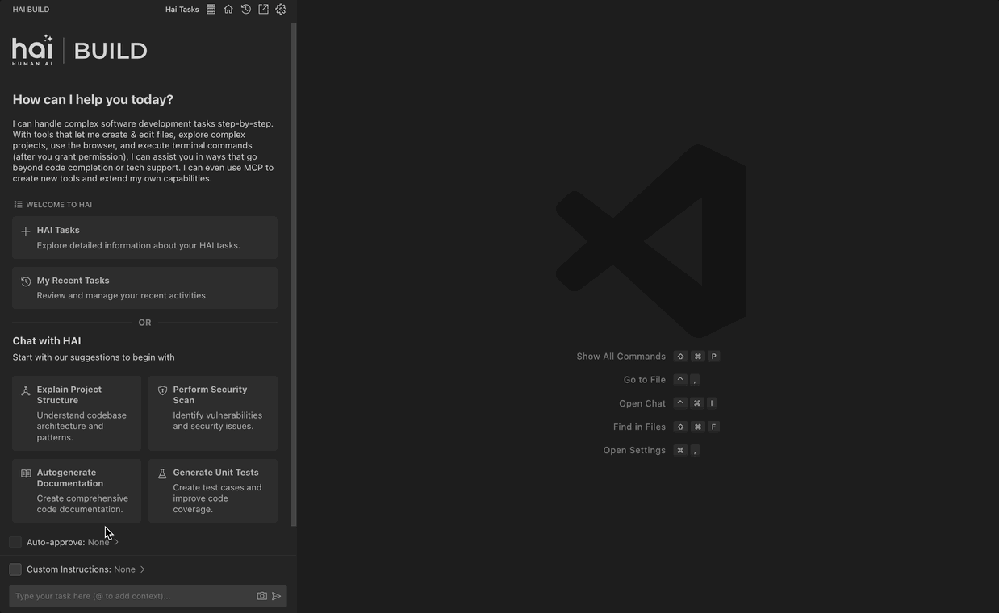
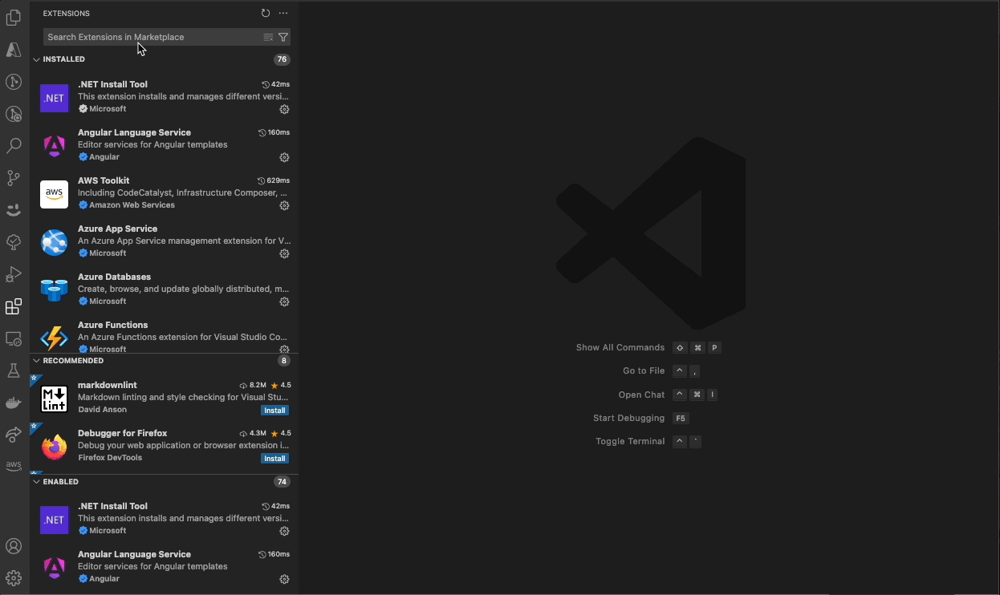
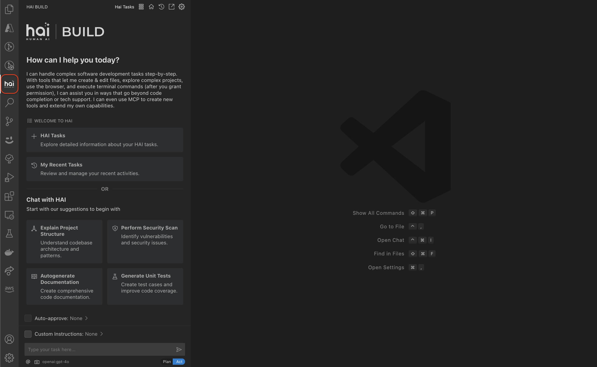
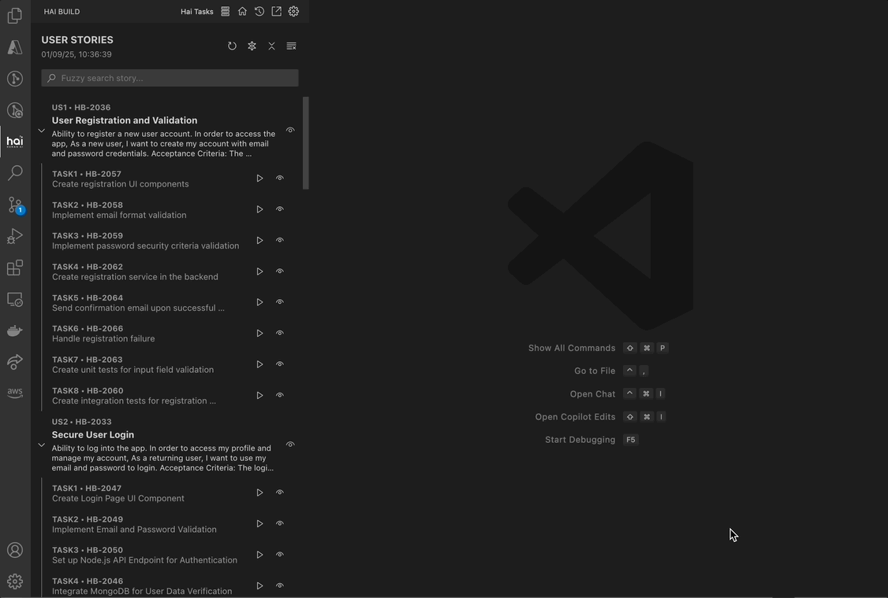

<div align="center">
  
  
  
  
</div>
<br />  
<div align="center">
  <picture>
    <source media="(prefers-color-scheme: dark)" srcset="assets/img/hai_build_logo_light.png">
    <source media="(prefers-color-scheme: light)" srcset="assets/img/hai_build_logo_theme.png">
    
  </picture>
</div>
<br />  

# 🚀 Code Generator

**HAI Code Generator** is a cutting-edge tool designed to simplify and automate task execution while enhancing code generation workflows. Leveraging Specif AI, it streamlines processes like task execution, file identification, and code documentation through intelligent automation and AI-driven capabilities.

> 🏗️ **Built on [Cline](https://github.com/cline/cline)**'s powerful foundation for AI-assisted development.

## ⚡ Extended Feature Set

- [🧑‍💻 Experts](#-experts) : Context-aware code generation with built-in and custom domain experts  
- [✏️ Inline Editing](#-inline-editing) : Make quick, AI-assisted edits without leaving your codebase  
- [📝 HAI Tasks](#-hai-tasks) : Integrate AI-generated user stories and tasks seamlessly into your workflow  
- [🔍 File Identification](#-file-identification) : Discover and contextualize code files with intelligent indexing  
- [⚙️ Settings Interface](#-settings-interface) : Easily configure LLMs and embedding models for tailored performance
- [📊 COR-Matrix Integration](#-cormatrix-integration) : Track AI code retention patterns and analyze code origin over time

<br>

<div align="center" style="margin-top: 20px;">
  
</div>

## Table of Contents

- [🌟 Overview](#-overview)
- [📥 Getting Started](#-getting-started)
- [✨ Features](#-features)
- [🤝 Contributing](#-contributing)
- [📜 License](#-license)
- [🙏 Acknowledgments](#-acknowledgments)
- [📧 Contact](#-contact)

## 🌟 Overview

**HAI Code Generator** is designed to boost productivity and precision by automating task execution and integrating file management capabilities. It combines intelligent file indexing, context generation, and LLM-driven automation to minimize manual effort and ensure task accuracy. With user-friendly interfaces and configurable settings, HAI Code Generator is perfect for both developers and teams aiming to enhance their workflows.

## 📥 Getting Started
- Open Visual Studio Code → Extensions (⇧⌘X) → Search for “HAI Build” → Click Install
<div align="center" style="margin-top: 20px;">
  
</div>

- Upon installation, the HAI extension can be found in the sidebar.

<div align="center" style="margin-top: 20px;">
  
</div>

## ✨ Features

### 📝 HAI Tasks
Harness the power of AI for seamless task management and user-story execution, HAI Code Generator integrates tasks generated by [Specif AI](https://github.com/presidio-oss/specif-ai), allowing them to be loaded directly into the HAI Tasks page. This streamlined process enables you to:

- **Review** AI-generated tasks within a dedicated interface.  
- **Execute** them instantly with a single click.  
- **Manage** all tasks in one place for improved clarity and productivity.  

By centralizing AI-driven tasks in HAI Code Generator, you can maintain an efficient workflow from ideation to execution.

<br>
  
  <div align="center">
    
    <p><i>Detailed View of HAI Tasks</i></p>
  </div>

- **In-Depth Story Review**  
  - View a story in detail by clicking the Eye icon, along with the corresponding list of tasks, providing comprehensive insights into objectives, prerequisites, and outcomes. 
  
- **In-Depth Task Review**  
  - Similar to user stories, tasks can be viewed in detail and executed directly from the same interface.
  
---
---

### 📊 Telemetry
Configure external telemetry settings to monitor and analyze your AI-powered development workflows with environment-specific customization capabilities.

- **External Configuration Override**  
  - Support for telemetry configuration overrides via a `.hai.config` file placed at the root of your workspace.
  - Enables environment-specific customization that can be dynamically injected through CI/CD pipelines.

- **Supported Override Parameters**  
  ```
  # Langfuse Configuration
  langfuse.apiUrl=
  langfuse.apiKey=
  langfuse.publicKey=
  
  # PostHog Configuration
  posthog.url=
  posthog.apiKey=
  ```

**Important Notes:**  
- The `.hai.config` file is not git-excluded by default. Ensure sensitive keys are not committed unintentionally to your repository.

---
## ✨ Upcoming Features

### 🧑‍💻 Experts

The **Experts** feature enables HAI Code Generator to deliver context-aware code generation tailored to specific technologies or domains.

<div align="center">
  
  <p><i>Experts</i></p>
</div>

#### Built-in Experts

- Four built-in experts are available: **.NET, Terraform, Node.js, and Go**.
- Each provides predefined guidelines and best practices in read-only mode for quick reference.

#### Custom Experts

- Users can create custom experts to define their own guidelines and (optionally) attach up to three reference document links.
- Custom experts are stored in the `.hai-experts` folder under a subfolder named after the expert.
- Each expert folder contains:
  - `metadata.json`: Stores expert name, creation date, and any document links.
  - `prompt.md`: Contains the expert’s guidelines (required).
- If document links are provided, a `docs` folder is created with:
  - Markdown files for each processed document.
  - `status.json` to track processing status.

**Note:**  
- Expert name and guidelines are mandatory when creating a custom expert.  
- Document links are optional and can be added for richer context.

This feature allows you to extend HAI Code Generator’s knowledge with your own standards, best practices, and documentation—ensuring more accurate and relevant code generation for your unique stack.

---

### 📖 Documentation
For comprehensive documentation and in-depth guides on HAI Code Generator features, visit our [Wiki](https://github.com/presidio-oss/hai-build-codegen/wiki).


## 🤝 Contributing

To contribute to the project, start by exploring [open issues](https://github.com/presidio-oss/hai-build-codegen/issues) or checking our [feature request board](https://github.com/presidio-oss/hai-build-codegen/discussions/categories/feature-requests?discussions_q=is%3Aopen+category%3A%22Feature+Requests%22+sort%3Atop).

To get started with HAI Code Generator, follow these steps:

<details>
<summary>Local Development Instructions</summary>

1. Clone the repository _(Requires [git-lfs](https://git-lfs.com/))_:
    ```bash
    git clone https://github.com/presidio-oss/hai-build-codegen
    ```

2. Open the project in VSCode:
    ```bash
    code hai-build-codegen
    ```

3. Install the necessary dependencies for the extension and webview-gui:
    ```bash
    npm run install:all
    ```

4. Launch by pressing F5 (or Run -> Start Debugging) to open a new VSCode window with the extension loaded. (You may need to install the [esbuild problem matchers extension](https://marketplace.visualstudio.com/items?itemName=connor4312.esbuild-problem-matchers) if you run into issues building the project.)

</details>
<br/>

Please read our [Contributing Guidelines](./CONTRIBUTING.md) for more details.

## 📜 License

This project is licensed under the Apache 2.0 License. See the [LICENSE](LICENSE) file for more details.

## 🙏 Acknowledgments

Thanks to all contributors and users for their support and feedback.

## 📧 Contact

For any questions or feedback, please contact us at [hai-feedback@presidio.com](mailto:hai-feedback@presidio.com).
